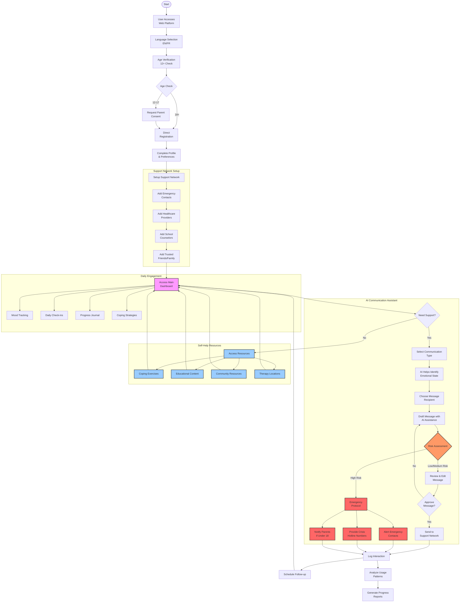

```mermaid
graph TD
    %% Initial Setup and Onboarding
    Start([Start]) --> A[User Accesses\nWeb Platform]
    A --> B[Language Selection\nEN/FR]
    B --> C[Age Verification\n12+ Check]
    
    %% Age-based Flow
    C --> D{Age Check}
    D -- "12-17" --> E[Request Parent\nConsent]
    D -- "18+" --> F[Direct\nRegistration]
    E --> F
    
    %% User Setup
    F --> G[Complete Profile\n& Preferences]
    G --> H[Setup Support Network]
    
    subgraph Support Network Setup
        H --> H1[Add Emergency\nContacts]
        H1 --> H2[Add Healthcare\nProviders]
        H2 --> H3[Add School\nCounselors]
        H3 --> H4[Add Trusted\nFriends/Family]
    end

    %% Main Dashboard
    H4 --> I[Access Main\nDashboard]
    
    subgraph Daily Engagement
        I --> J1[Mood Tracking]
        I --> J2[Daily Check-ins]
        I --> J3[Progress Journal]
        I --> J4[Coping Strategies]
    end

    %% Crisis Support Flow
    I --> K{Need Support?}
    
    subgraph AI Communication Assistant
        K -- Yes --> L[Select Communication\nType]
        L --> M[AI Helps Identify\nEmotional State]
        M --> N[Choose Message\nRecipient]
        N --> O[Draft Message with\nAI Assistance]
        O --> P{Risk Assessment}
        
        P -- High Risk --> Q[Emergency\nProtocol]
        Q --> R1[Alert Emergency\nContacts]
        Q --> R2[Provide Crisis\nHotline Numbers]
        Q --> R3[Notify Parents\nif Under 18]
        
        P -- Low/Medium Risk --> S[Review & Edit\nMessage]
        S --> T{Approve\nMessage?}
        T -- No --> O
        T -- Yes --> U[Send to\nSupport Network]
    end

    %% Post-Communication
    U --> V[Log Interaction]
    R1 --> V
    R2 --> V
    R3 --> V
    V --> W[Schedule Follow-up]
    
    %% Alternative Flow
    K -- No --> X[Access Resources]
    subgraph Self-Help Resources
        X --> Y1[Coping Exercises]
        X --> Y2[Educational Content]
        X --> Y3[Community Resources]
        X --> Y4[Therapy Locations]
    end
    
    %% Return to Dashboard
    Y1 --> I
    Y2 --> I
    Y3 --> I
    Y4 --> I
    W --> I

    %% Data Collection
    V --> Z1[Analyze Usage\nPatterns]
    Z1 --> Z2[Generate Progress\nReports]
    
    %% Styling
    classDef dashboard fill:#f9f,stroke:#333,stroke-width:2
    classDef risk fill:#f96,stroke:#333,stroke-width:2
    classDef emergency fill:#f66,stroke:#333,stroke-width:2
    classDef resource fill:#9cf,stroke:#333,stroke-width:2
    
    class I dashboard
    class P risk
    class Q,R1,R2,R3 emergency
    class X,Y1,Y2,Y3,Y4 resource
```